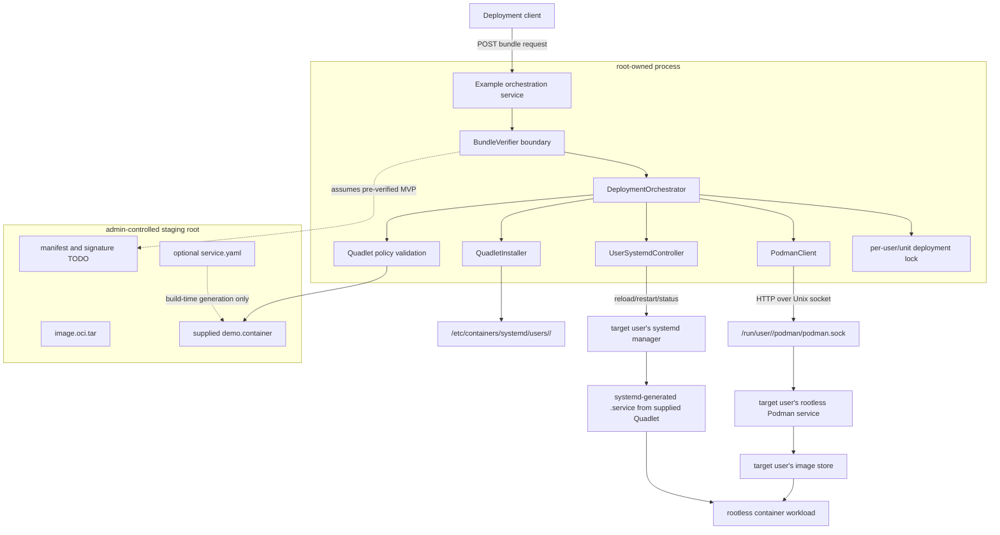

# podman-manager

MVP C++23 library and example service for a root-owned orchestrator that deploys
supplied image archives and supplied Quadlet files for multiple rootless Podman
users.

The current deployment path is:

1. pass through an explicit bundle-verification boundary,
2. validate the supplied bundle and Quadlet policy,
3. optionally load a staged image archive through the target user's Podman API
   socket,
4. snapshot the currently installed Quadlet,
5. atomically install the supplied `.container` Quadlet under
   `/etc/containers/systemd/users/<uid>/`,
6. reload the target user's systemd manager,
7. restart the generated `.service` unit and verify final status,
8. roll back the Quadlet if reload/restart fails.

The MVP assumes the received bundle has already been signed and verified. The
library contains a `BundleVerifier` TODO boundary so signature, manifest digest,
signer identity, and artifact-to-manifest binding can be wired in without moving
the deployment trust boundary.

Quadlet files are explicit deployment artifacts in this MVP. The root
orchestrator does not synthesize `.container` files from `ContainerSpec` or any
other runtime model; it validates, installs, snapshots, and rolls back the
supplied Quadlet. Podman and systemd then generate the corresponding `.service`
unit from that installed file during reload.

If a higher-level service description is added later, generation should happen
before signing and deployment, for example:

```text
service.yaml
  -> podman-manager-quadletgen
  -> demo.container
  -> signed bundle manifest
  -> runtime deployment
```

Runtime deployment should still consume the generated `.container` artifact, not
silently create one from implicit defaults.

Image loading through `DeploymentOrchestrator` requires
`DeploymentOptions::image_archive_root`. Archive paths are opened relative to
that root with `openat()` and `O_NOFOLLOW`, capped by
`max_image_archive_bytes`, and streamed to Podman by file descriptor. The
low-level `PodmanClient::load_image_archive(path)` helper remains available for
trusted direct callers.
`ImageArchive::expected_sha256` is reserved for the future manifest verifier;
non-empty values are rejected so callers do not mistake it for active digest
verification.

## Build

```bash
cmake -S . -B build -DCMAKE_BUILD_TYPE=Debug
cmake --build build
ctest --test-dir build --output-on-failure
```

The repo also carries CMake presets extracted from the cgen `presets` layer and
trimmed for this project:

```bash
cmake --preset=debug
cmake --build --preset=debug
ctest --preset=debug

cmake --workflow --preset=nosdbus
```

Required build dependency: libcurl. Test builds use gentest as the only test
framework and require CMake 3.31+ plus a clang/LLVM-capable gentest codegen
toolchain. CMake first tries `find_package(gentest CONFIG)`, then a pinned
FetchContent revision. For fully offline local development with a checkout:

```bash
cmake --preset=debug -DPODMAN_MANAGER_GENTEST_SOURCE_DIR=/path/to/gentest
cmake --build --preset=debug
ctest --preset=debug
```

If `sdbus-c++` is available, CMake also builds the optional D-Bus systemd
backend. The example service intentionally uses a small local HTTP listener
instead of `uWebSockets` because `uWebSockets` is not installed in this
environment. The orchestration handler is separate from the listener so a
`uWebSockets` adapter can replace it later.

## Library Surface

- `PodmanClient`: HTTP over AF_UNIX using libcurl, with helpers for `_ping`,
  info, list, create, start, stop, remove, and image archive load.
- `DeploymentOrchestrator`: deploys a supplied image archive and supplied
  `.container` Quadlet for a target uid. Deployments hold a per-user/unit lock,
  validate final unit status, and perform systemd-aware Quadlet rollback after
  reload/restart failures.
- `QuadletInstaller`: validates policy and atomically installs supplied Quadlet
  text into the configured admin-controlled rootless search path. It snapshots
  existing files so deployments can roll back after post-install failures.
- `UserSystemdController`: lifecycle abstraction for user systemd managers,
  with a `systemctl --user --machine=<user>@.host` backend and an optional
  `sdbus-c++` backend. Lifecycle methods return waited final status.
- `ContainerSpec`: minimal SpecGenerator-compatible JSON for one-container
  deployments. This remains useful for direct Podman REST flows, but the
  bundle deployment path does not generate Quadlets from it.
- `validate_podman_socket`: rejects symlinks, non-sockets, wrong owners, and
  paths outside the expected `/run/user/<uid>/podman/podman.sock` layout.
- `SystemctlSliceController`: applies runtime-only `user-<uid>.slice`
  properties via `posix_spawnp("systemctl", ...)`, avoiding shell
  interpolation.

## Example Service

Stage an image archive and Quadlet file. Dry-run mode is the default and does
not contact Podman, write the Quadlet, or call systemd:

```bash
./build/podman_manager_example_service \
  --listen 127.0.0.1:9090 \
  --staging-root /var/lib/podman-manager/staging

curl -X POST \
  'http://127.0.0.1:9090/v1/deploy-bundle?user=alice&quadletPath=/var/lib/podman-manager/staging/demo.container&imageArchive=/var/lib/podman-manager/staging/demo.oci.tar&revision=42'
```

Execute mode validates the target rootless socket when loading an image archive,
loads the image, installs the Quadlet, reloads the user manager, and restarts
the generated service:

```bash
sudo ./build/podman_manager_example_service \
  --execute \
  --staging-root /var/lib/podman-manager/staging

curl -X POST \
  'http://127.0.0.1:9090/v1/deploy-bundle?user=alice&quadletPath=/var/lib/podman-manager/staging/demo.container&imageArchive=/var/lib/podman-manager/staging/demo.oci.tar&revision=42'
```

This example is local-only and unauthenticated. It is meant to demonstrate the
library boundary, not to be exposed as a production API.

## Supplied Quadlet Example

```ini
[Unit]
Description=Demo service

[Container]
Image=localhost/demo:latest
Label=com.example.podman-manager.managed=true
ReadOnly=true
NoNewPrivileges=true
DropCapability=all

[Service]
Restart=on-failure
TimeoutStartSec=900

[Install]
WantedBy=default.target
```

The MVP policy rejects unsupported sections and keys, host-executing `[Service]`
directives, `PodmanArgs=`, privileged containers, host networking, host
PID/IPC/user namespaces, devices, host path bind mounts, `Rootfs=`, missing
`Image=`, and missing or duplicate managed labels.

The example service only reads staged Quadlet and image archive files under
`--staging-root`. It opens staged paths by walking from the staging root with
`openat()` and `O_NOFOLLOW`, requires regular files, caps Quadlet size at 1 MiB,
and passes image archive paths to the deployment library as staging-relative
paths.

Image loading is not fully transactional in this MVP: if Podman imports an
archive and a later Quadlet reload/restart fails, the Quadlet is rolled back but
the imported image may remain in the target user's rootless image store. Treat
image cleanup as a retention/GC policy until image response parsing and
remove-on-failure are added.

## Architecture


